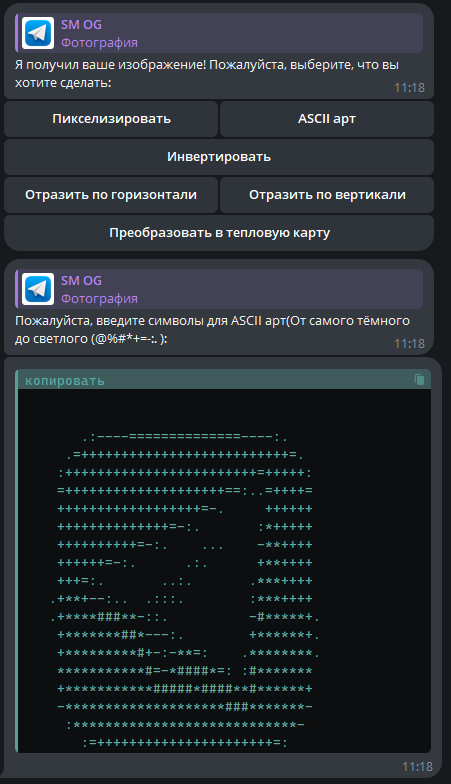

# Описание
Телеграм бот, который позволяет пользоваться множеством функций для работы с изображениями или доплнительные текстовые функции, такие как случайная шутка и случайный комплимент.
Для работы с изображениями доступны следующие функции:
1. Пикселизация  
2. ASCII-арт  
3. Инвертирование   
4. Отражение   
5. Преобразование в тепловую карту   

# Как пользоваться? 
- Команда /start для работы с изображениями;   
- Команда /text для текстовых функций;   

# Примеры работы
1. Работа с изображениями  

2. Текстовые функции  

